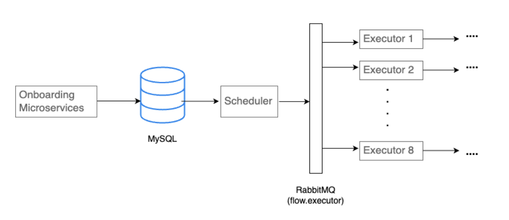

# Job Scheduler as a service

## Problem Statement 
Managing and scheduling jobs, especially in a large-scale system, can be complex and inefficient. There's a lack of centralized, automated solutions that can handle job dependencies, retries, and notifications. 

The challenge is to develop a job scheduling service that can streamline job management, enhance visibility, and improve efficiency.

Every month on the billing cycle, a credit card company sends credit card statements to its customers. Each statement generation takes 5 seconds. With a customer base of 50k, it takes around ~70 hours. The organization wants to aggressively expand its customer base to 10 million in the next 5 months. The current cron-based solution is not sustainable and it requires a rethink of system design to finish it in minutes. 

## Scheduling System

- Similarity to Cron Jobs:
  - Concept: Like cron jobs in Unix-like systems, this scheduling system automates recurring tasks at specific times or intervals.
  - Advantage: By storing schedules in a database, it offers flexibility and manageability compared to static cron configurations.

- Database-Driven Scheduling:
  - Storage of Schedules: All schedules are stored in a database, allowing for dynamic updates and easy management through CRUD operations.
  - Daily Processing: Once every day, the scheduler system queries the database to retrieve schedules that are due for execution within the next 24 hours.

- Concurrency and Parallel Processing:
  - Implementation with Executors: Concurrent executors enable parallel processing of multiple schedules simultaneously.
  - Efficiency Boost: This concurrent approach optimizes system resources, potentially reducing overall processing time for large numbers of records.

- Workflow Efficiency:
  - Handling Multiple Records: By executing processes in parallel, the system can efficiently handle a significant number of records scheduled for execution.
  - Scalability: The system can scale by adjusting the number of concurrent executors based on workload demands, ensuring responsiveness and throughput.

- Benefits:
  - Flexibility: Database-driven scheduling allows for easy modification and management of schedules without modifying code.
  - Performance: Concurrent execution enhances processing speed and efficiency, accommodating diverse workload sizes and complexities.
  - Reliability: By centralizing schedule management in a database, the system improves reliability and maintenance, supporting robust operation over time.

- Considerations:
  - Error Handling: Robust error handling mechanisms ensure graceful recovery from failures, enhancing system reliability.
  - Monitoring: Continuous monitoring of scheduler performance and database interactions helps optimize resource usage and preemptively address issues.




--- 

### Scheduler

The scheduler is a Java application designed to perform the following tasks:

1. Connect to PostgreSQL Database: It establishes a connection to a PostgreSQL database using JDBC to fetch data.

2. Fetch Data: Queries the database to retrieve rows where the `next_execution_time` falls within the next 24 hours from the current time.

3. Publish to RabbitMQ Queue: For each fetched row (payload), it publishes the data to a RabbitMQ queue for further processing or distribution.

---

### Executor

1. Fetches data from queue: It will fetch batches of the payload from the queue.

2. Process multiple payloads using concurrency: Implement parallel running threads for processing multiple payloads simultaneously

---

### Sample Database

This tuple is a schedule inside the DB which is processed and updated by the scheduler.

| id                                       | payload | iter_type | next_execution_time |        |         |            |
|------------------------------------------|---------|-----------|---------------------|--------|---------|------------|
| 5feabcdbcabcacefbbacbebfbacdebfbabfbedba | {...}   | YEARLY, MONTHLY, WEEKLY, DAILY | 22-07-2024 |


**id** : unique identifier for the scheduled job

**payload** : Contains data related to processing ( bill generation, SIP etc. )

**iter_type** : It is the recurrence value and could be any one of the following ( WEEKLY, MONTHLY, YEARLY or DAILY )

**next_execution_time** : It is the time at which the next execution should take place. It will be updated after every successful execution by the executor.

### Numbers

```
1 req ( 5 sec ) : 8 threads * 1 pods ( 8 req in 5 sec ) ~ 1.6 req / sec ( 138,240 req / day )

1 req ( 5 sec ) : 16 threads * 1 pods ( 16 req in 5 sec ) ~ 3.2 req / sec ( 276,480 req / day )

1 req ( 5 sec ) : 32 threads * 1 pods ( 32 req in 5 sec ) ~ 6.4 req / sec ( 552,960 req / day )
```

> If we run 32 threads * 48 pods, we will achieve ~1.1 million req per hour, i.e ~600 minutes ( 10 hours ) for 10 million req.
